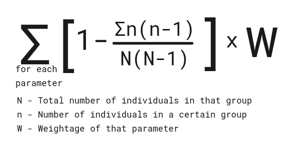

# Diversity and Inclusion Dashboard

Link :- https://did-hjb3.onrender.com

## Introduction

A comprehensive dashboard that monitors diversity and inclusion scores across the organization, facilitating informed decision-making and promoting inclusivity. Through advanced data visualization techniques, the dashboard offers insightful diversity pie charts and survey analysis, allowing for a comparative analysis of current scores and identifying areas for improvement. This empowers organizations to track progress, drive meaningful change, and encourage a more diverse and inclusive workplace culture.

## Features
- ### Diversity Management
    - ##### Diversity Score Calculation
        Inspired by Simphon's diversity score, system computes scores based on various parameters, each assigned a specific weight by the admin.
    - ##### Visualizing Diversity Trends
        Line Graphs to depict the evolution of diversity scores over time. Additionally, Pie Charts offer a clear visual representation of diversity in terms of gender, ethnicity, location, age, and more.
    - #### Strategic Goal Setting
        Admin have the capability to establish diversity score targets for the entire organization or for specific departments, promoting targeted and measurable diversity goals.
- ### Inclusion
    - ##### Feedbacks
        Anonymous feedback forms, enabling candid insights without fear of repercussion.
    - ##### Engaging Surveys
        Employees can actively participate in surveys designed to gather comprehensive information on diversity and inclusion within the organization.
    - ##### Inclusion Score Metric
        Our platform quantifies organizational inclusivity through an Inclusion Score, which is the average of survey scores provided by each employee. The weightage assigned by the administrator ensures a nuanced and accurate reflection of inclusivity efforts.

## Diversity score

## Dependencies

- React JS
- Node
- Express
- MongoDB
- AWS